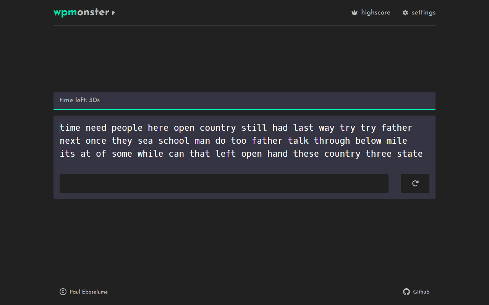

# wpmonster

[](https://app.netlify.com/sites/wpmonster/deploys)

<br>



A Lightweight Typing website 👹

Checkout [wpmonster](https://wpmonster.netlify.app/)

## How to run locally

```zsh
git clone https://github.com/eroblaze/wpmonster.git
cd wpmonster
npm install
npm run dev
```

### Created with

- `TypeScript`
- `React`
- `SCSS`
- `redux-toolkit`
